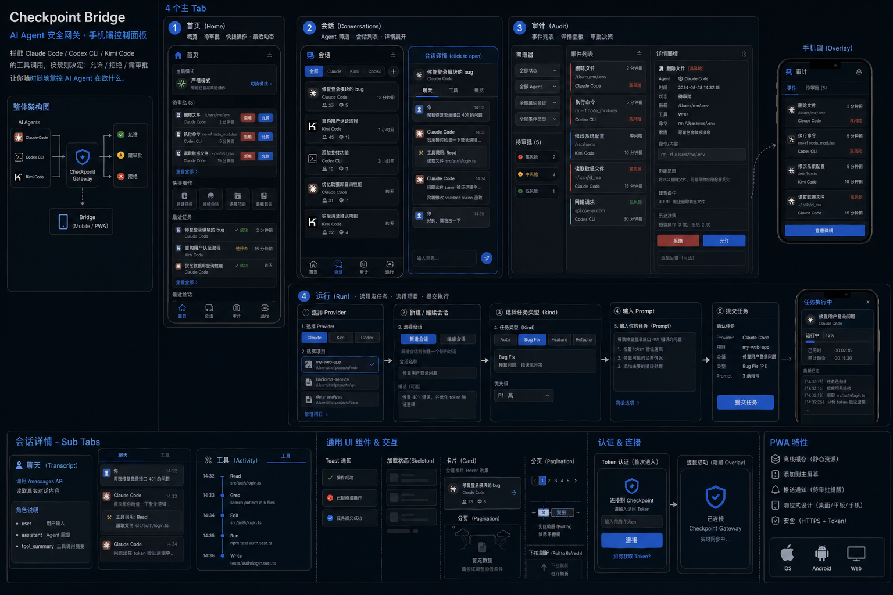

# Agent Aspect

[English](README.md) | [简体中文](README.zh-CN.md)

> Before, around, and after hooks for AI coding agents.

Agent Aspect is a local runtime control plane for AI coding agents. It sits in front of tools such as Claude Code, Codex CLI, and Kimi Code, observes tool calls, applies local policy, records an audit trail, and gives the user a control plane for approvals, conversations, jobs, and learned-rule suggestions.



## What It Does

- **Policy enforcement:** intercepts risky tool calls through agent hook systems and returns allow / ask / deny decisions.
- **Unified audit trail:** stores events, decisions, conversations, jobs, feedback, and device attribution in SQLite.
- **Bridge control center:** exposes a token-protected local HTTP UI for Home, Conversations, Audit, and Run workflows.
- **Remote job runner:** submits whitelisted local jobs or provider prompts, with cancellation, log streaming, and stale-job recovery.
- **Conversation overview:** imports provider titles and transcripts, then groups chat messages and tool activity by provider and project.
- **Runtime guardrails:** binds continue actions to provider/runtime identity and surfaces model, permission, or path drift before a resume goes wrong.
- **Learn Mode:** suggests future auto-allow rules from real ask-to-allow patterns, while keeping explicit deny rules authoritative.
- **Multi-device attribution:** records which browser or local hook made a decision using layered device IDs.
- **Relay mobile control (optional):** pairs a phone browser through a user-owned relay so approvals, conversations, and jobs can continue away from the Mac.

## Architecture

```text
AI Agents
  ├─ Claude Code hooks
  ├─ Codex CLI hooks / transcripts
  └─ Kimi Code hooks
        │
        ▼
checkpoint-hook ── Unix socket ── checkpointd
        │                           │
        │                           ├─ Rule engine
        │                           ├─ Learned-rule fallback
        │                           └─ SQLite audit.db
        │
        ▼
checkpoint-bridge ── HTTP + token ── Web / mobile browser
        │
        └──── WSS ── checkpoint-relay ── Phone browser  (optional)
```

Core product rule:

> Express mechanisms exhaustively, expose policy gradually, and make trust traceable.

## Recommended Deployment

| Path | When to use |
|------|-------------|
| **Local only** | Default. Daemon + bridge run on your Mac. Phone accesses bridge over LAN. |
| **LAN / Tailscale** | Phone and Mac on the same network or Tailscale mesh. No relay needed. |
| **Self-hosted relay** | Phone is on a different network (e.g. mobile data). You run `checkpoint-relay` on a VPS you control. |

Relay is an optional remote phone channel. It is not a default dependency, not cloud sync, not an account system, and not a multi-tenant SaaS. See [docs/relay.md](docs/relay.md) for details.

## Quickstart

### Prerequisites

- macOS (Apple Silicon)
- Rust toolchain (`rustup`)
- Claude Code, Codex CLI, or Kimi Code installed

### Build

```bash
cargo build --release
```

### Install and run

```bash
# Install the CLI, daemon, hook, and bridge binaries
cargo install --path crates/cli
cargo install --path crates/daemon
cargo install --path crates/hook-cli
cargo install --path crates/bridge

# Initialize config
checkpoint init

# Run the doctor to verify your setup
checkpoint doctor

# Start the daemon (background, listens on Unix socket)
checkpoint daemon start

# Start the bridge (token-protected HTTP UI)
checkpoint bridge start

# Get the bridge token for browser access
checkpoint bridge token

# Open the bridge UI in your browser
open http://127.0.0.1:7676
```

### Set your enforcement mode

```bash
# Observer: log everything, block nothing
checkpoint mode observer

# Autonomous: auto-allow safe calls, ask on risky ones
checkpoint mode autonomous

# Guard: ask before most write operations
checkpoint mode guard

# Paranoid: ask before everything
checkpoint mode paranoid
```

### Build and run the relay (optional)

```bash
# Build the relay binary
cargo install --path crates/relay

# Run on your VPS (or locally for testing)
checkpoint-relay
```

See [docs/relay.md](docs/relay.md) for pairing and deployment.

## Development

```bash
cargo fmt --check
cargo test
scripts/smoke_test.sh
scripts/bridge_smoke_test.sh
scripts/relay_smoke_test.sh
```

Useful local commands:

```bash
checkpoint doctor
checkpoint mode guard
checkpoint bridge start
checkpoint bridge status
checkpoint bridge token
```

## Repository Layout

```text
crates/
  core/       Shared types, SQLite audit store, rule engine, normalization, transcripts
  daemon/     Unix-socket daemon that evaluates hook requests
  hook-cli/   Agent hook entrypoint
  cli/        checkpoint command-line management tool
  bridge/     Token-protected HTTP bridge and embedded web UI
  relay/      User-owned VPS relay for phone access to the Mac bridge
  shared_ui/  Shared frontend primitives used by bridge and relay

docs/         Public configuration, relay, security, and scope docs
scripts/      Smoke tests for core and bridge flows
```

## Supported Agents

| Agent | Status |
|-------|--------|
| Claude Code | Supported |
| Codex CLI | Supported |
| Kimi Code | Supported |
| Gemini CLI | Candidate (no runtime experiments, not claimed as supported) |

## Security Model

- **Trust anchor is your Mac.** The daemon, rule engine, and audit store all run locally.
- The bridge token is generated locally and stored under `~/.checkpoint/bridge.token`.
- All bridge API endpoints require Bearer token auth except `GET /health`.
- Bridge CORS is intentionally not enabled by default.
- Jobs are restricted to whitelisted kinds and known project paths.
- Device IDs are for audit attribution, not user authentication.
- Learned rules never override explicit deny rules. Deny is always authoritative.
- If you run a relay on the public internet, it must use HTTPS/WSS. Do not use an untrusted relay.

See [docs/security.md](docs/security.md) for the full security model.

## Docs

- [docs/config.md](docs/config.md) -- Configuration reference
- [docs/relay.md](docs/relay.md) -- Relay deployment guide
- [docs/security.md](docs/security.md) -- Security model
- [docs/open-source-scope.md](docs/open-source-scope.md) -- What is and is not in scope

## License

Licensed under the Apache License, Version 2.0. See [LICENSE](LICENSE).
